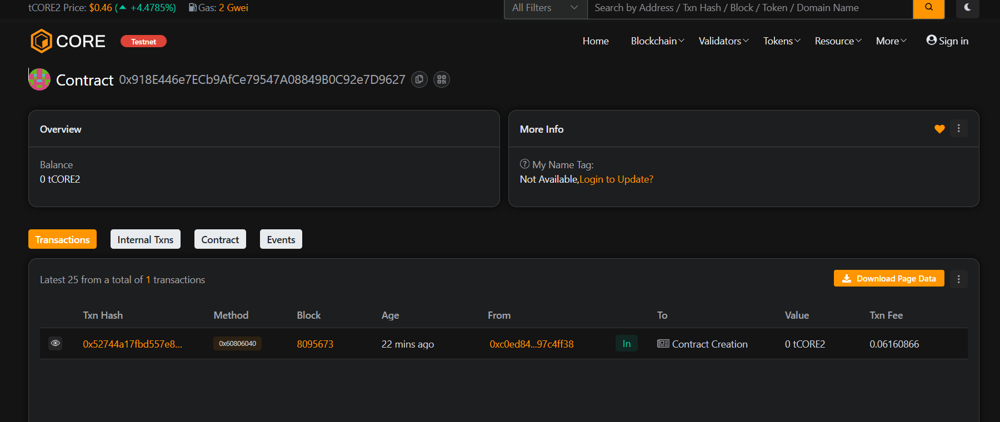

# CryptexSphere

### Project Description
CryptexSphere is a minimal on-chain puzzle vault (a "crytex") where creators lock ETH rewards behind hashed answers. Solvers submit plaintext answers (preimages) to claim rewards. The contract stores puzzle metadata (answer hash, reward, creator, expiry, solver) and is optimized for gas-efficiency and simple frontend integration.

### Project Vision
Enable permissionless, provable puzzle bounties that let creators fund challenges and let solvers claim rewards trustlessly on-chain — ideal for gamified incentives, educational challenges, or bounty campaigns.

### Key Features
- createPuzzle(bytes32 answerHash, uint256 durationSeconds, bytes hint) payable — create a puzzle, fund reward, set expiry and optional hint.
- solvePuzzle(uint256 id, string answer) — submit plaintext answer; if keccak256(answer) matches the stored hash the solver receives the reward and puzzle is marked solved.
- withdrawExpired(uint256 id) — puzzle creator retrieves the reward if the puzzle expired unsolved.
- getPuzzle(uint256 id) view — fetch puzzle metadata (answerHash, creator, reward, solved, solver, expiresAt, hint).
- Events for PuzzleCreated, PuzzleSolved, PuzzleWithdrawn for easy off-chain indexing.

### Future Scope
- Optional ERC-20 reward support and timelocked payouts.
- Puzzle leaderboards, reputation, and solver royalties.
- On-chain proof-of-work or rate-limiting to deter brute-force.
- NFT-wrapped puzzles or tokenized solver achievements.
- Better hinting & encrypted/off-chain clue systems.

### Contract address:
0x918E446e7ECb9AfCe79547A08849B0C92e7D9627
